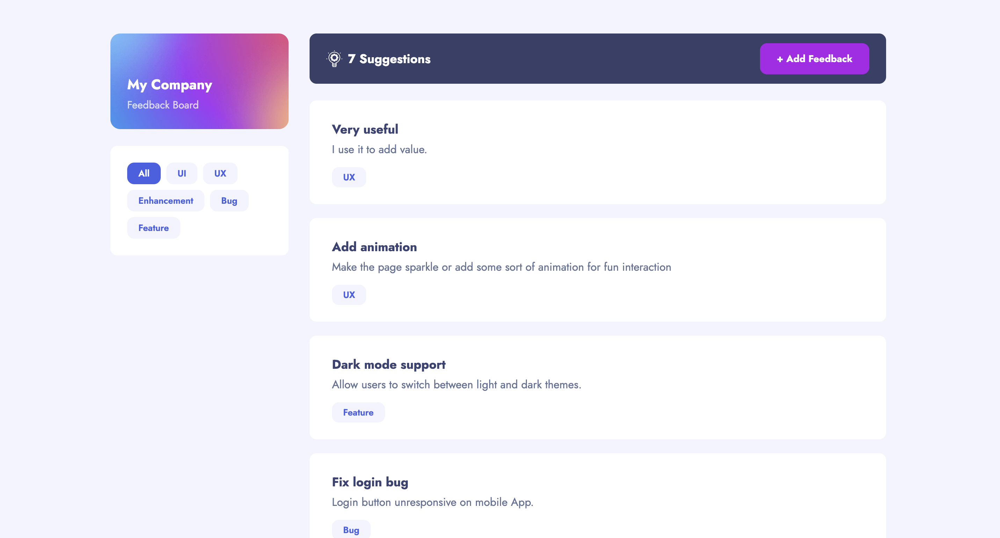

# Product Feedback App

## 📌 Project Description & Purpose

This project is a full-stack product feedback application where users can view, filter, and submit suggestions to help improve a company's product. It was built as a freelance project for **My Company**.

---

## 🚀 Live Site

Here's the link to view the live app: [product-feedback-app-haine.netlify.app](https://product-feedback-app-haine.netlify.app)

---

## 🖼️ Screenshots



---

## ✨ Features

This is what you can do on the app:

- View all product suggestions on the home page
- Filter suggestions by category (UI, UX, Enhancement, Bug, Feature)
- Submit new feedback using the Add Feedback form
- See a "no feedback" empty state when a filtered category has no results
- Responsive layout that works on mobile and desktop

---

## 🛠️ Tech Stack

**Frontend**
- Languages: HTML, CSS, JavaScript
- Framework: React (Vite), React Router
- Deployment: Netlify

**Server/API**
- Languages: JavaScript (Node.js)
- Framework: Express
- Deployment: Render

**Database**
- Languages: PostgreSQL (SQL)
- Deployment: Neon

---

## 🔹 API Documentation

These are the API endpoints I built:

1. `GET /get-all-suggestions` — Returns all suggestions from the database
2. `GET /get-suggestions-by-category/:category` — Returns suggestions filtered by category
3. `POST /add-one-suggestion` — Adds a new suggestion to the database

Here's the link to the full API documentation: [api-documentation.md](./api-documentation.md)

---

## 🗄️ Database Schema

Here's the SQL I used to create my tables:

```sql
CREATE TABLE suggestions (
  id SERIAL PRIMARY KEY,
  title VARCHAR(255) NOT NULL,
  description TEXT,
  category VARCHAR(50)
);
```

---

## 💭 Reflections

What I learned: that the second time you do things it gets easier.

What I'm proud of: that i be able to picture the bigger picture and achieve them 

What challenged me: refresh my memory with some css

Future ideas for how I'd continue building this project:

1. Add upvoting so users can vote on suggestions
2. Add the ability to edit and delete suggestions
3. Add comments to suggestions

---

## 🙌 Credits & Shoutouts

Shoutout to ME ! yay 
